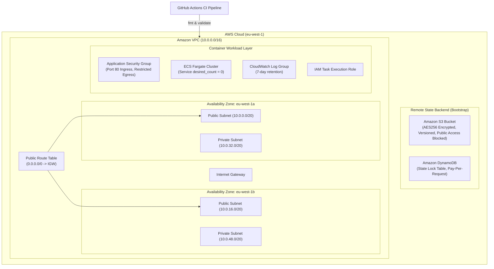

# AWS Platform Engineering Lab


A production-grade AWS infrastructure and platform engineering project demonstrating modern Infrastructure as Code (IaC), multi-AZ network isolation, remote state locking, container orchestration with Amazon ECS (Fargate), automated CI/CD linting, and rigorous FinOps cost controls.

---

## 🏛️ Architecture Overview



---

## 🚀 Key Engineering Highlights

### 1. Multi-AZ Resilient Networking
- Isolated VPC (`10.0.0.0/16`) deployed across 2 Availability Zones (`eu-west-1a`, `eu-west-1b`).
- 2 Public Subnets with an Internet Gateway and custom route tables.
- 2 Private Subnets isolated from direct internet ingress.

### 2. Production Remote State Management (Bootstrap Pattern)
- Decoupled `bootstrap/` module that creates the state storage before provisioning core infrastructure.
- **S3 Bucket**: Versioning enabled (instant rollback from state corruption), default `AES256` encryption, and all public access blocked.
- **DynamoDB State Locking**: Prevents concurrent execution and race conditions across team deployments.

### 3. Container Orchestration (AWS ECS on Fargate)
- Serverless container execution using AWS Fargate (no EC2 instances to patch or manage).
- Least-privilege IAM Task Execution Role.
- Centralized logging streamed to Amazon CloudWatch with an explicit 7-day retention period.

### 4. FinOps & Cost Engineering ($0.00 Idle Cost)
Designed specifically to respect cloud budgets and eliminate idle resource waste:
- **No NAT Gateways**: Eliminates the \$32/month per-AZ fee.
- **Zero-Cost Compute Idle**: ECS service defaults to `desired_count = 0`. Compute runs only when actively tested.
- **No Idle Public IPv4 Addresses**: Eliminates AWS's \$0.005/hour IPv4 charges.
- **Strict CloudWatch Log Retention**: Caps log accumulation at 7 days.
- **DynamoDB On-Demand**: `PAY_PER_REQUEST` billing mode incurs zero idle cost.

### 5. Automated CI/CD (GitHub Actions)
- Automated `.github/workflows/terraform-ci.yml` pipeline triggers on every push and pull request.
- Enforces `terraform fmt -check -recursive`.
- Validates syntax and configuration across all modules (`terraform init -backend=false` & `terraform validate`).

---

## 📁 Repository Structure

```text
├── .github/
│   └── workflows/
│       └── terraform-ci.yml    # Automated Terraform lint & validation pipeline
├── bootstrap/                  # Dedicated state backend provisioning
│   ├── main.tf                 # S3 bucket and DynamoDB lock table
│   ├── variables.tf            # Region and resource name variables
│   ├── versions.tf             # Provider requirements
│   └── outputs.tf              # Bucket and lock table outputs
├── terraform/                  # Core platform infrastructure
│   ├── main.tf                 # VPC, subnets, IGW, and route tables
│   ├── security.tf             # Application security groups
│   ├── ecs.tf                  # ECS Cluster, Task Definition, Service, IAM, Logs
│   ├── variables.tf            # Configurable inputs & desired task counts
│   ├── versions.tf             # S3 remote backend configuration
│   └── outputs.tf              # VPC, Subnet, and Service IDs
├── .gitignore                  # Strict exclusion for state, credentials, and cache
└── README.md
```

---

## 🛠️ Deployment Instructions

### Prerequisites
- [AWS CLI](https://aws.amazon.com/cli/) configured with an IAM user (least-privilege/admin permissions).
- [Terraform CLI](https://www.terraform.io/) (v1.6.0+).

### 1. Provision the Remote State Backend
```powershell
cd bootstrap
terraform init
terraform plan
terraform apply
```

### 2. Deploy Core Infrastructure
```powershell
cd ../terraform
terraform init
terraform plan
terraform apply
```

### 3. Test Running the Workload (Optional)
To spin up 1 live container task for testing:
```powershell
terraform apply -var="app_desired_count=1"
```
When testing is complete, scale back down to zero to eliminate compute charges:
```powershell
terraform apply -var="app_desired_count=0"
```

### 4. Teardown / Destroy Infrastructure
To completely destroy all lab resources:
```powershell
# In terraform/ directory:
terraform destroy -auto-approve

# In bootstrap/ directory (if tearing down state backend):
cd ../bootstrap
terraform destroy -auto-approve
```

---

## 👤 Author
**James Monokpe**  
*AWS Cloud & Platform Engineer*  
*Certifications: AWS Certified Solutions Architect – Associate | AWS Certified Cloud Practitioner*
